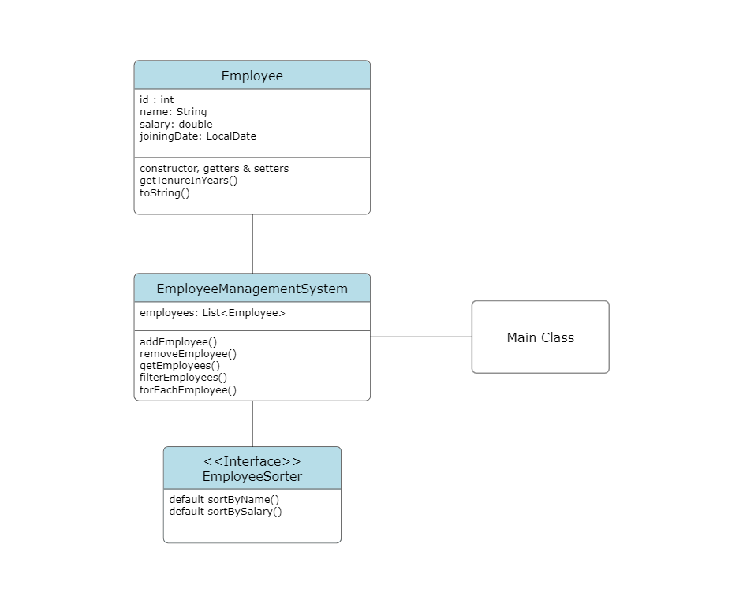

This is a mini java demo for implementing modern features of java 8 such as -
<ul>
<li>Lambda Functions</li>
<li>Method References</li>
<li>Functional Interfaces</li>
<li>Streams API</li>
<li>Date and Time API</li>
</ul>

The implementation has been done with the help of an Employee Management System (EMS).

<h3>UML of the Employee Management System</h3>

